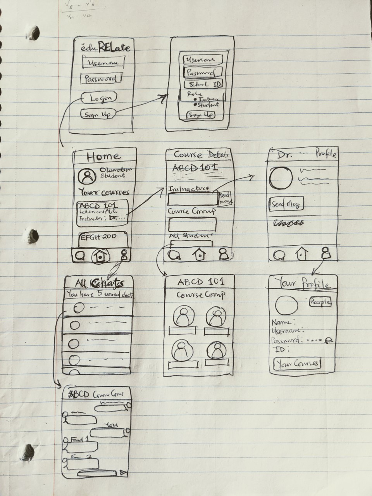

Original App Design Project - README Template
===

# EDURELATE

## Table of Contents
1. [Overview](#Overview)
1. [Product Spec](#Product-Spec)
1. [Wireframes](#Wireframes)
2. [Schema](#Schema)

## Overview
### Description
The aim of this app is to make communication in a school community very easy. It allows students to communicate with themselves and share relevant information.

### App Evaluation
[Evaluation of your app across the following attributes]
- **Category:** Education
- **Mobile:** Implements vertical scrolling and tabs for viewing enrollments and tasks.
- **Story:**
- **Market:** App is useful for all students (and even non-student users).
- **Habit:** Students are using the app every day to keep up with school work. Students cannot do without communicating. They will need this app daily to make sure they are up to date with their friends.
- **Scope:** At the basic level, this app is about sending messages among students personally and in groups. At v2, the app will be able to set up events such as study time, exams, and assignments. At v3, the students should be able to communicate via video calling.

## Product Spec

### 1. User Stories (Required and Optional)

**Required Must-have Stories**

* User can login
* User can register a new account.
  * User can specify their role.
* There should be persistence in logged in user
* User can logout
* User can see all friends and groups in people screen.
* User can send messages to people.
* User can reply to a message
  * User can double tap to reply to a message.
* User can like a message.
* Users can create new groups.
* A group owner can invite a user
  * A user can accept or reject an invite.
* User can leave a group
* Users can send and accept friend requests
* ...

**Optional Nice-to-have Stories**
* User can add optional profile picture.
* User cannot use a used username.
* User can change profile details.
* User can hide a chat from all chats.
  * User can show hidden chats.
* Groups in the Home screen are arranged according to the most used
* Users can create events
* Events can be synced with Google Calendar
* Users can send files and photos.
    * Files and images in messages can be previewed.
* User can see who is typing in chat.
* User can give different reactions to a message.
  * User can hold the like button to see the different reactions.
* Students can set up office hours with their instructors.
    * Students can see the available spaces
    * Students or instructors can cancel an appointment two hours earlier
        * Anyone canceling should send a private message to other individuals involved
* Students can search for other students using the app by name.
    * Students can search for other students by major.
* Users can make video calls on the app
* ...

### 2. Screen Archetypes

* Login screen
   * User can login
   * User can register a new account.
   * ...
* Sign up fragment
   * User can register a new account.
   * User can specify their role.
* Home Screen
   * User can see study groups
     * User can see 5 most used study groups
   * User sees a welcome info: "Hey, User!"
   * Home screen shows user profile pic
   * User can add a profile pic
   * ...
* User Profile Screen
    * User can see profile picture
    * User can see their information
    * User can see their friends and groups
* People Screen
    * Friends fragment
    * Groups fragment
* Friends Fragment
    * User can see all their friends
    * Users can see friend requests
    * User can send friend requests
      * User can see all users that are not friends
    * User can accept friend requests.
* Groups Fragment
    * User can create a group
    * User can see all groups
* Group Details Screen
    * User can see all the users in a group
    * If current user is the owner, user can invite a new member
    * User can leave a group
* Join a New Group Screen
    * User can see all the groups
    * User can create a new group
* Create a New Group fragment
    * User can create a new group
* All Chats Screen
    * User can see all the people (students, friends, instructors, and groups) that have been in a conversation.
    * User can see the number of unread messages
* Chat Details Screen
    * User can see all the messages from a person or in a group

### 3. Navigation

**Tab Navigation** (Tab to Screen)
These are the tabs common to all the screens.
* Home tab - to Home screen
* Chats tab - to All Chats screen
* My Profile tab - to Profile screen
* Back tab - to previous screen

**Flow Navigation** (Screen to Screen)

* Login screen
    * Sign up screen
    * Welcome screen
* Sign up
    * Home screen
* Home screen
    * People screen
    * Profile screen
* People Screen
    * Friends fragment
    * Groups fragment
* Friends Fragment
    * Find New Friend Scrren
* Groups Fragment
    * Join New Group Screen
* Join New Group Screen
    * People Screen (Groups tab)
* All Chats Screen
    * Chat Details Screen
* Chat Details Screen
    * Profile Screen
    * Group Details screen
    * Login screen
* Group Details Screen
    * Profile screen
    * Chat Details screen
[Optional]
* People Screen
* Friends Fragment
* Groups Fragment

## Wireframes


### [BONUS] Digital Wireframes & Mockups

### [BONUS] Interactive Prototype

## Schema 
### Models
#### User
| Property    | Type        | Description            | Required   | 
| ----------- | ----------- | -----------            | ---------- |
| objectId    | String      | unique id for this user object |      yes    |
| username    | String      | username for this app                  |     yes       |
| password    | String      | password for this app                  |     yes         |
| first name    | String      | user's first name                  |     yes         |
| last name     | String      | user's last name                   |     yes          |
| userPhoto   | File        | user's display photo                   |      no     |
| friends       | Array<User>      | user's friends                   |       no      |
| groups         | Array<Group> | all groups associated with user |    no       |
| major         | Major | the user's major |    no       |
#### Group
| Property    | Type        | Description            | Required   | 
| ----------- | ----------- | -----------            | ---------- |
| objectId    | String      | unique id for this group object  |      yes    |
| groupName    | String      | the name of the group                |     yes       |
| isFriendGroup        | boolean        | true if this consists of two friends | yes |
| owner    | User      | the owner of the group       |     yes         |
| chat    | Chat      | the chat of the group       |     yes         |
| users     | Array<User>      | array of students in this group            |     yes          |
#### Chat
| Property    | Type        | Description            | Required   | 
| ----------- | ----------- | -----------            | ---------- |
| objectId    | String      | unique id for this chat object  |      yes    |
| isGroupChat        | boolean        | true if chat is a group chat | yes |
| group        | Group        | group associated with this chat | yes |
| messages   | Array<Messages>        | messages in this chat                 |      yes     |
#### Message
| Property    | Type        | Description            | Required   | 
| ----------- | ----------- | -----------            | ---------- |
| objectId    | String      | unique id for this message object  |      yes    |
| createdAt    | Date      | date when message was sent                  |     yes         |
| replyTo    | Message      | the message this object is replying (if any)     |     no         |
| sender    | User      | instructor for this course                  |     yes         |
| usersLikingThis   | Array<User>        | users that have liked this message                    |      yes     |
#### Invite
| Property    | Type        | Description            | Required   | 
| ----------- | ----------- | -----------            | ---------- |
| objectId    | String      | unique id for this message object  |      yes    |
| isGroupInvite    | boolean      | true if this is an invite to a group      |     yes         |
| inviteSender    | User      | person sending the invite      |     yes         |
| inviteRecipient    | User      | person receiving the invite      |     yes         |
*Optional*
#### Major
| Property    | Type        | Description            | Required   | 
| ----------- | ----------- | -----------            | ---------- |
| objectId    | String      | unique id for this message object  |      yes    |
| majorTitle    | String      | major title                 |     yes         |

### Networking
#### List of network requests by screen
* Login screen
  * (Read/GET) Get current user
* Sign up
  * (Create/POST) Create a new user
    ```java
    ParseUser user = new ParseUser();
    user.setUsername(username);
    user.setPassword(password);
    user.signUpInBackground(new SignUpCallback() {
        public void done(ParseException e) {
            if (e == null) {
                Toast.makeText(LoginActivity.this, "Successful!", Toast.LENGTH_SHORT).show();
            } else {
                Log.i(TAG,"Failed sign up");
                Toast.makeText(LoginActivity.this, "Error signing up!", Toast.LENGTH_SHORT).show();
            }
        }
    });
    ```
* Home screen
  * (Read/GET) Get all groups of the user
    ```java
    List<Group> groups = LoginActivity.currentUser.getGroups();
    ```
  * (Read/GET) Get user information (profile pic, name, and id)
* People screen
* Friends fragment
  * (Read/GET) Get all friends of the user
  * (Update/PUT) Accept or reject a new invite
    ```java
    invite.put(KEY_STATUS, currentStatus);
    invite.save();
    ```
* Groups fragment
  * (Read/GET) Get all groups for the user
  * (Create/POST) Accept or reject a new invite
    ```java
    invite.put(KEY_STATUS, currentStatus);
    invite.save();
    ```
* Join a New Group Screen
  * (Read/GET) Get all existing groups
    ```java
    ParseQuery query = new ParseQuery(Group.class);
    query.include(KEY_OWNER);
    query.setLimit(MAX_GROUP_NUM);
    query.findInBackground(new FindCallback<Group>() {
        @Override
        public void done(List<Group> groups, ParseException e) {
            if (e != null) {
                Log.e(TAG,"Failure in querying groups.",e);
                return;
            }
            Log.i(TAG,"Success in querying groups.");
        }
    });
    ```
  * (Create/POST) Send an invite
    ```
    Invite invite = new Invite();
    invite.setSender(sender);
    invite.setRecipient(receiver);
    invite.setStatus(Invite.STATUS_NONE);
    invite.save();
    ```
* Create a New Group fragment
  * (Create/POST) Create a new group object
    ```
    invite.put(KEY_STATUS, currentStatus);
    invite.save();
    ```
* All Chats Screen
  * (Read/GET) Get chats for the current user
* Chat Details Screen
  * (Read/GET) Get messages for the current chat
  * (Create/POST) Create a new message
    ```
    invite.put(KEY_STATUS, currentStatus);
    invite.save();
    ```
  * (Create/POST) Like (or unlike) a message
* Group Details Screen
  * (Read/GET) Get all users in a group
  * (Create/POST) Create a new invite
    ```
    invite.put(KEY_STATUS, currentStatus);
    invite.save();
    ```
- [OPTIONAL: List endpoints if using existing API such as Yelp]
